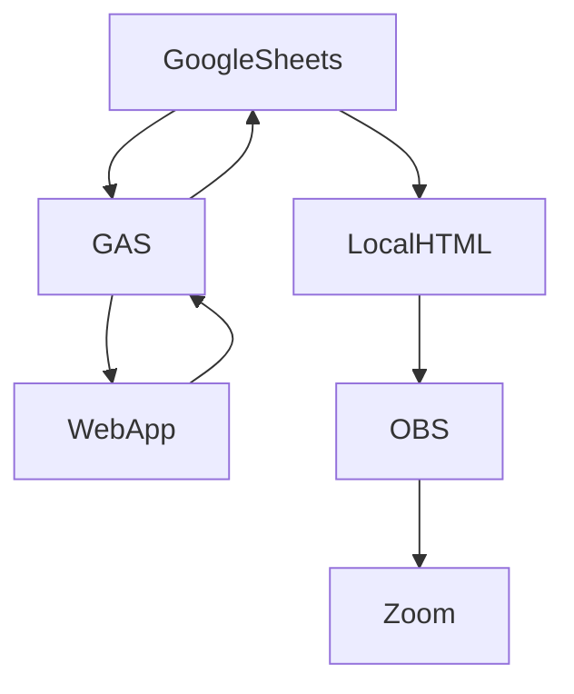

# Meeting-Timer-Web-App
An example of combining tools to record meeting details. Tools used in this process are Google Sheets, Google Application Script, local HTML, OBS and Zoom.

# Setup
Google Sheet with Google App Script--> [Copy Google Sheet and script for the Timer App](https://docs.google.com/spreadsheets/d/1YbaUzI7DMh1Orqz31gqL0c4pw2PeIC1uXLST0YoQpbw/copy)

HTML file to display Google Sheet content in OBS [local HTML file](https://github.com/UUoocl/Timer-Web-App/blob/main/localIndex.html)

OBS -->[OBS project](https://obsproject.com/)

[Zoom.us](https://zoom.us/)

# Share The Google Sheet and Google Script

## The Google Sheet will need to be shared. 
Click the Share button
  

- 

## Deploy the Google Apps Script as a Web App
The App script can be found by navigating to the Extensions-->Apps Script

Click Deploy --> New Deployment

-

