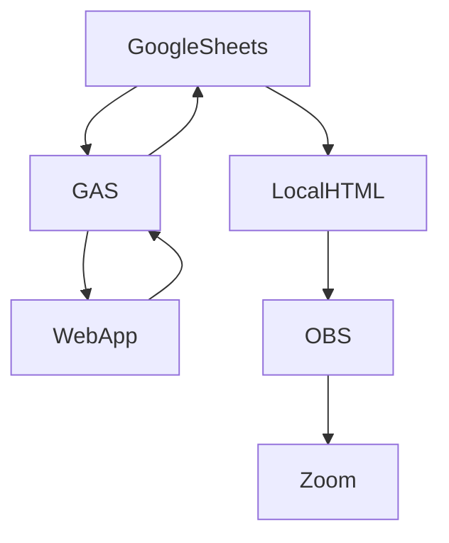

# Meeting-Timer-Web-App
An example of combining tools to record meeting details. Tools used in this process are Google Sheets, Google Application Script, local HTML, OBS and Zoom.

# Setup
Example Google Sheet with Google App Script-->Copy Google Sheet

Google App Script and WebApp HTML,JS,CSS code -->Copy Google Apps Script

HTML file to display Google Sheet content is OBS -->

[OBS project]()

[Zoom.us]()

